# Introduction

This is a simple framework for training neural networks to detect nodules in CT images. Training requires a json file (e.g. [here](https://github.com/zhwhong/lidc_nodule_detection/blob/master/CNN_LSTM/hypes/lstm_rezoom_lung.json)) containing a list of CT images and the bounding boxes in each image. The model combines both CNN model and LSTM unit. The algorithm here is mainly refered to paper [***End-to-end people detection in crowded scenes***](https://arxiv.org/abs/1506.04878).

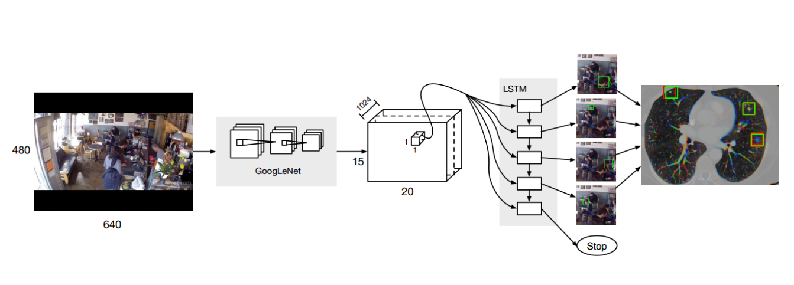

The deep learning framewoek is based on [TensorFlow](https://github.com/tensorflow/tensorflow)(version 1.0.0) and some coding ideas are forked from the [TensorBox](https://github.com/TensorBox/TensorBox) project. Here I show heartfelt gratefulness.
About nodule classfication method based on CNN transfer learning, you can refer to [this paper](https://arxiv.org/abs/1602.03409).

# Dicom and XML parsing

Parsing the lidc XML annotation and dicom files，see [pylung](https://github.com/zhwhong/lidc_nodule_detection/blob/master/pylung) and [this blog](http://zhwhong.cn/2017/03/27/LIDC-Dicom-data-and-XML-annotation-parse/).

```python
>>> import dicom
>>> f = dicom.read_file('000001.dcm')
>>> print f
(0008, 0005) Specific Character Set              CS: 'ISO_IR 100'
(0008, 0008) Image Type                          CS: ['ORIGINAL', 'PRIMARY', 'AXIAL']
(0008, 0016) SOP Class UID                       UI: CT Image Storage
(0008, 0018) SOP Instance UID                    UI: 1.3.6.1.4.1.14519.5.2.1.6279.6001.143451261327128179989900675595
(0008, 0020) Study Date                          DA: '20000101'
(0008, 0021) Series Date                         DA: '20000101'
(0008, 0022) Acquisition Date                    DA: '20000101'
(0008, 0023) Content Date                        DA: '20000101'
(0008, 0024) Overlay Date                        DA: '20000101'
(0008, 0025) Curve Date                          DA: '20000101'
(0008, 002a) Acquisition DateTime                DT: '20000101'
(0008, 0030) Study Time                          TM: ''
(0008, 0032) Acquisition Time                    TM: ''
(0008, 0033) Content Time                        TM: ''
(0008, 0050) Accession Number                    SH: '2819497684894126'
(0008, 0060) Modality                            CS: 'CT'
(0008, 0070) Manufacturer                        LO: 'GE MEDICAL SYSTEMS'
(0008, 0090) Referring Physician Name            PN: ''
(0008, 1090) Manufacturer Model Name             LO: 'LightSpeed Plus'
(0008, 1155) Referenced SOP Instance UID         UI: 1.3.6.1.4.1.14519.5.2.1.6279.6001.675906998158803995297223798692
(0010, 0010) Patient Name                        PN: ''
(0010, 0020) Patient ID                          LO: 'LIDC-IDRI-0001'
(0010, 0030) Patient Birth Date                  DA: ''
(0010, 0040) Patient Sex                         CS: ''
(0010, 1010) Patient Age                         AS: ''
(0010, 21d0) Last Menstrual Date                 DA: '20000101'
(0012, 0062) Patient Identity Removed            CS: 'YES'
(0012, 0063) De-identification Method            LO: 'DCM:113100/113105/113107/113108/113109/113111'
(0013, 0010) Private Creator                     LO: 'CTP'
(0013, 1010) Private tag data                    LO: 'LIDC-IDRI'
(0013, 1013) Private tag data                    LO: '62796001'
(0018, 0010) Contrast/Bolus Agent                LO: 'IV'
(0018, 0015) Body Part Examined                  CS: 'CHEST'
(0018, 0022) Scan Options                        CS: 'HELICAL MODE'
(0018, 0050) Slice Thickness                     DS: '2.500000'
(0018, 0060) KVP                                 DS: '120'
(0018, 0090) Data Collection Diameter            DS: '500.000000'
(0018, 1020) Software Version(s)                 LO: 'LightSpeedApps2.4.2_H2.4M5'
(0018, 1100) Reconstruction Diameter             DS: '360.000000'
(0018, 1110) Distance Source to Detector         DS: '949.075012'
(0018, 1111) Distance Source to Patient          DS: '541.000000'
(0018, 1120) Gantry/Detector Tilt                DS: '0.000000'
(0018, 1130) Table Height                        DS: '144.399994'
(0018, 1140) Rotation Direction                  CS: 'CW'
(0018, 1150) Exposure Time                       IS: '570'
(0018, 1151) X-Ray Tube Current                  IS: '400'
(0018, 1152) Exposure                            IS: '4684'
(0018, 1160) Filter Type                         SH: 'BODY FILTER'
(0018, 1170) Generator Power                     IS: '48000'
(0018, 1190) Focal Spot(s)                       DS: '1.200000'
(0018, 1210) Convolution Kernel                  SH: 'STANDARD'
(0018, 5100) Patient Position                    CS: 'FFS'
(0020, 000d) Study Instance UID                  UI: 1.3.6.1.4.1.14519.5.2.1.6279.6001.298806137288633453246975630178
(0020, 000e) Series Instance UID                 UI: 1.3.6.1.4.1.14519.5.2.1.6279.6001.179049373636438705059720603192
(0020, 0010) Study ID                            SH: ''
(0020, 0011) Series Number                       IS: '3000566'
(0020, 0013) Instance Number                     IS: '80'
(0020, 0032) Image Position (Patient)            DS: ['-166.000000', '-171.699997', '-207.500000']
(0020, 0037) Image Orientation (Patient)         DS: ['1.000000', '0.000000', '0.000000', '0.000000', '1.000000', '0.000000']
(0020, 0052) Frame of Reference UID              UI: 1.3.6.1.4.1.14519.5.2.1.6279.6001.229925374658226729607867499499
(0020, 1040) Position Reference Indicator        LO: 'SN'
(0020, 1041) Slice Location                      DS: '-207.500000'
(0028, 0002) Samples per Pixel                   US: 1
(0028, 0004) Photometric Interpretation          CS: 'MONOCHROME2'
(0028, 0010) Rows                                US: 512
(0028, 0011) Columns                             US: 512
(0028, 0030) Pixel Spacing                       DS: ['0.703125', '0.703125']
(0028, 0100) Bits Allocated                      US: 16
(0028, 0101) Bits Stored                         US: 16
(0028, 0102) High Bit                            US: 15
(0028, 0103) Pixel Representation                US: 1
(0028, 0120) Pixel Padding Value                 US: 63536
(0028, 0303) Longitudinal Temporal Information M CS: 'MODIFIED'
(0028, 1050) Window Center                       DS: '-600'
(0028, 1051) Window Width                        DS: '1600'
(0028, 1052) Rescale Intercept                   DS: '-1024'
(0028, 1053) Rescale Slope                       DS: '1'
(0038, 0020) Admitting Date                      DA: '20000101'
(0040, 0002) Scheduled Procedure Step Start Date DA: '20000101'
(0040, 0004) Scheduled Procedure Step End Date   DA: '20000101'
(0040, 0244) Performed Procedure Step Start Date DA: '20000101'
(0040, 2016) Placer Order Number / Imaging Servi LO: ''
(0040, 2017) Filler Order Number / Imaging Servi LO: ''
(0040, a075) Verifying Observer Name             PN: 'Removed by CTP'
(0040, a123) Person Name                         PN: 'Removed by CTP'
(0040, a124) UID                                 UI: 1.3.6.1.4.1.14519.5.2.1.6279.6001.335419887712224178340067932923
(0070, 0084) Content Creator's Name              PN: ''
(0088, 0140) Storage Media File-set UID          UI: 1.3.6.1.4.1.14519.5.2.1.6279.6001.211790042620307056609660772296
(7fe0, 0010) Pixel Data                          OW: Array of 524288 bytes
```

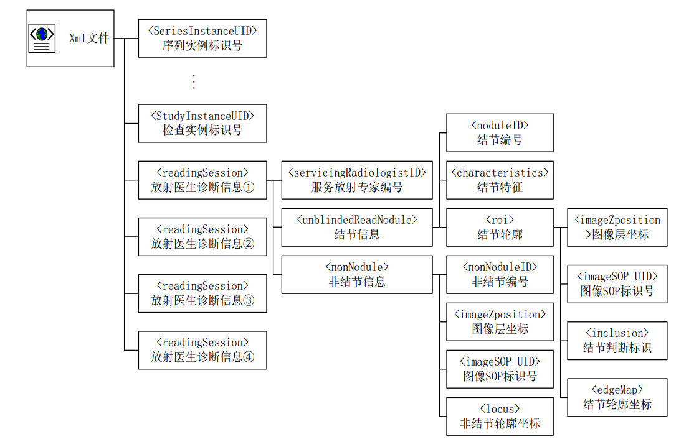

# Training

First, [install TensorFlow from source or pip](https://www.tensorflow.org/versions/r0.11/get_started/os_setup#pip-installation) (NB: source installs currently break threading on 0.11). Then run the training script `CNN_LSTM/run.sh`.Note that running on your own dataset should require modifying the `CNN_LSTM/hypes/\*.json` file.

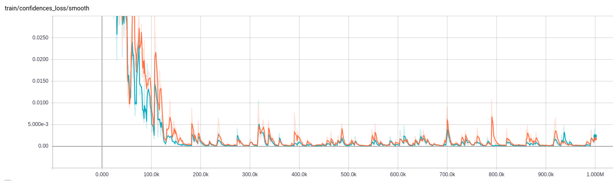
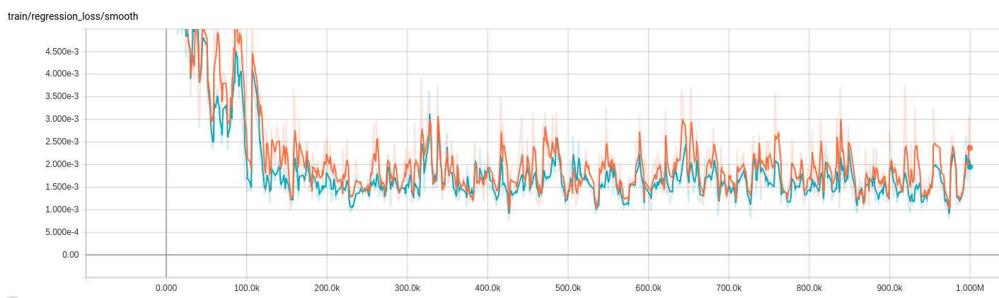
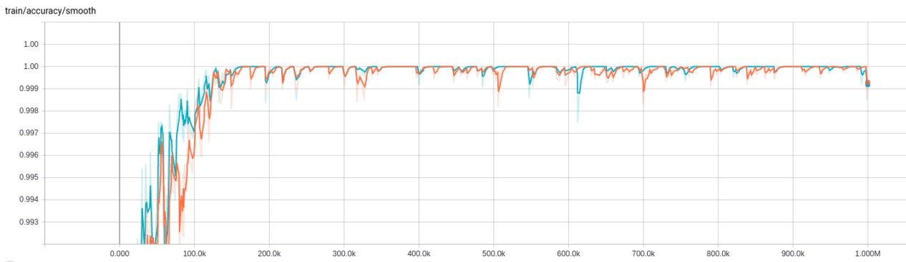

<p style="text-align:center;">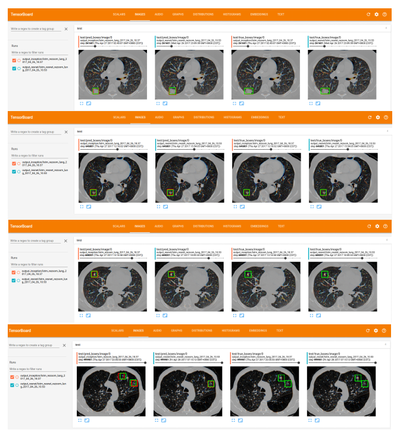</p>

# Evaluation

There are two options for evaluation, an [ipython notebook](https://github.com/zhwhong/lidc_nodule_detection/blob/master/CNN_LSTM/evaluate.ipynb) and a [python script](https://github.com/zhwhong/lidc_nodule_detection/blob/master/CNN_LSTM/evaluate.py).

- some test results

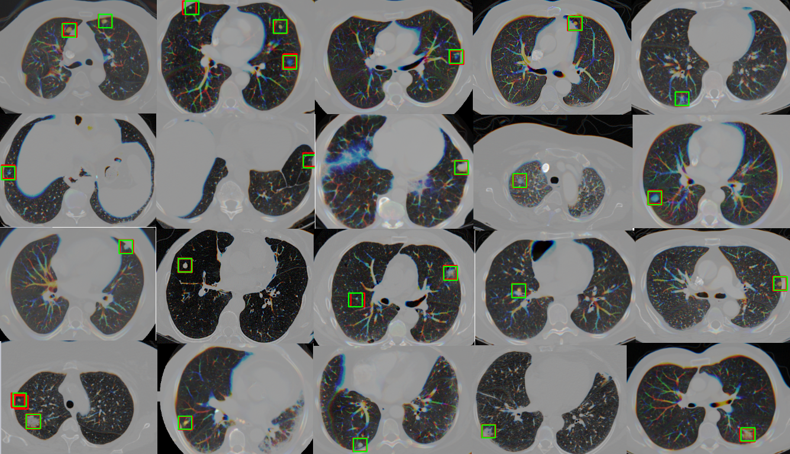

- precision-recall curve

<p style="text-align:center;">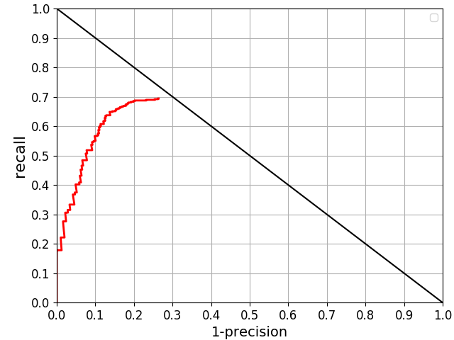</p>

# Other

- Anatomy map

<p style="text-align:center;">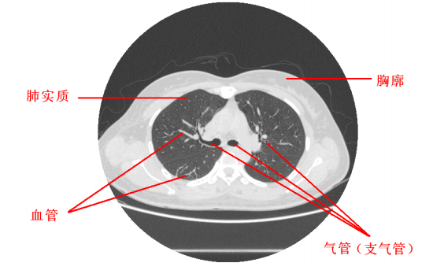</p>

- Parenchyma extraction

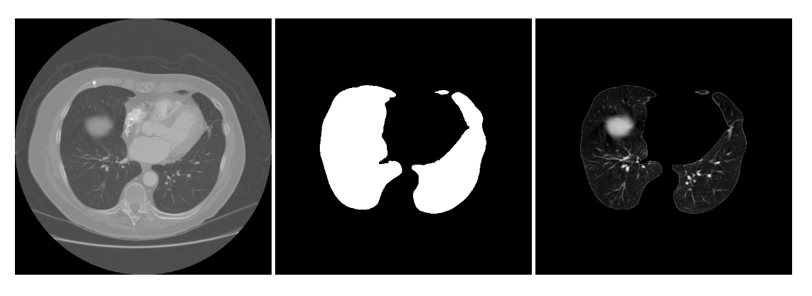

- Pulmonary nodules form

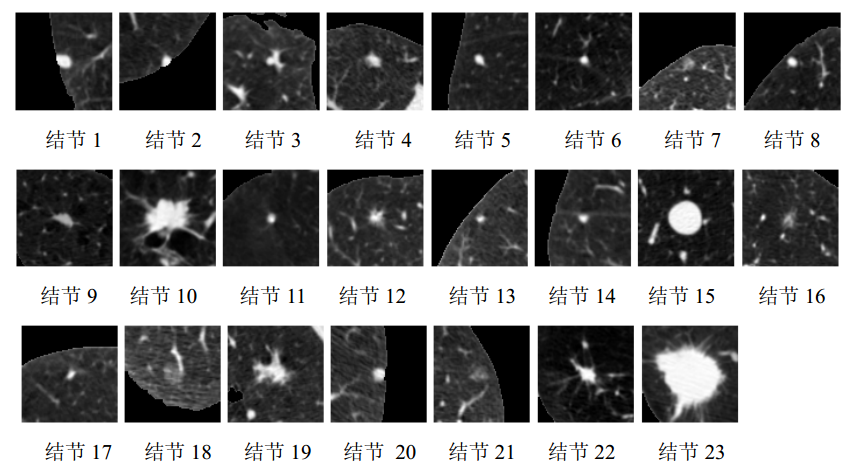


# Reference

- [Dataset] [The Lung Image Database Consortium image collection(LIDC-IDRI)](https://wiki.cancerimagingarchive.net/display/Public/LIDC-IDRI)
- [Paper] [***End-to-end people detection in crowded scenes***](https://arxiv.org/abs/1506.04878)
- [Paper] [***Deep Convolutional Neural Networks for Computer-Aided Detection: CNN Architectures, Dataset Characteristics and Transfer Learning***](https://arxiv.org/abs/1602.03409)
- [Paper] [***An overview of classification algorithms for imbalanced datasets***](http://www.ijetae.com/files/Volume2Issue4/IJETAE_0412_07.pdf)
- [Blog] [LIDC-IDRI肺结节公开数据集Dicom和XML标注详解](http://zhwhong.cn/2017/03/27/LIDC-Dicom-data-and-XML-annotation-parse/)
- [Blog] [机器学习之分类性能度量指标 : ROC曲线、AUC值、正确率、召回率](http://zhwhong.cn/2017/04/14/ROC-AUC-Precision-Recall-analysis/)
- [简书] [LIDC-IDRI肺结节Dicom数据集解析与总结](http://www.jianshu.com/p/9c1facf70b01)
- [简书] [LIDC-IDRI肺结节公开数据集Dicom和XML标注详解](http://www.jianshu.com/p/c4e9e18195eb)
- [简书] [医疗CT影像肺结节检测参考项目(附论文)](http://www.jianshu.com/p/14df9c48453a)
- [简书] [如何应用Python处理医学影像学中的DICOM信息](http://www.jianshu.com/p/df64088e9b6b)
- [简书] [CT图像肺结节识别算法调研 — CNN篇](http://www.jianshu.com/p/e7dbad9e48ff)
- [简书] [吕乐：面向医学图像计算的深度学习与卷积神经网络（转）](http://www.jianshu.com/p/d29223ee2cb2)
